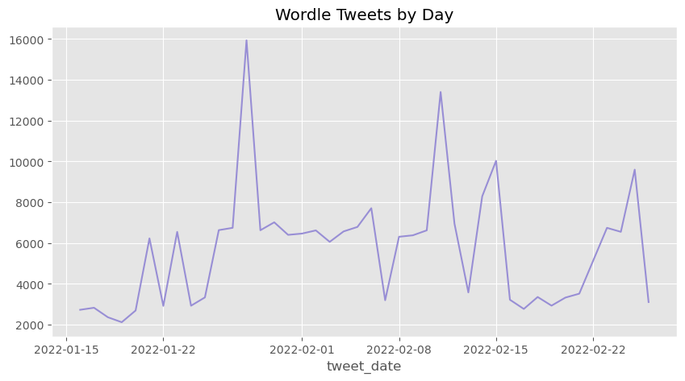
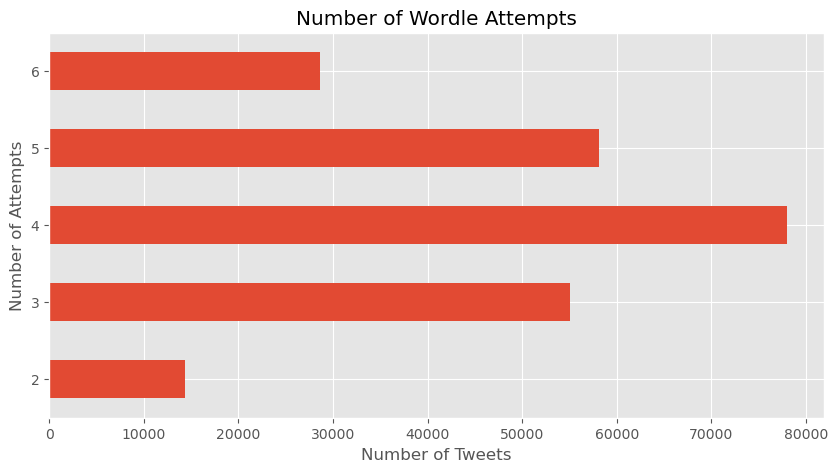
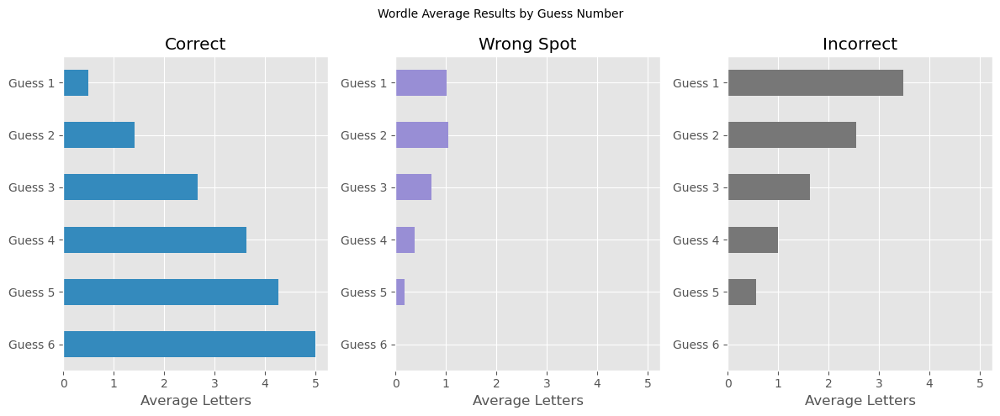

```python
import pandas as pd
import matplotlib.pylab as plt
from itertools import cycle

plt.style.use("ggplot")
color_pal = plt.rcParams["axes.prop_cycle"].by_key()["color"]
```


```python
pd.set_option('display.max_columns', 500)
```

# Load and Proccess Dataset


```python
df = pd.read_csv('./data/tweets.csv')
```


```python
df.head()
```


<div>
<style scoped>
    .dataframe tbody tr th:only-of-type {
        vertical-align: middle;
    }

    .dataframe tbody tr th {
        vertical-align: top;
    }

    .dataframe thead th {
        text-align: right;
    }
</style>
<table border="1" class="dataframe">
  <thead>
    <tr style="text-align: right;">
      <th></th>
      <th>wordle_id</th>
      <th>tweet_id</th>
      <th>tweet_date</th>
      <th>tweet_username</th>
      <th>tweet_text</th>
    </tr>
  </thead>
  <tbody>
    <tr>
      <th>0</th>
      <td>210</td>
      <td>1482553374591660037</td>
      <td>2022-01-16 03:20:43+00:00</td>
      <td>bpszebes</td>
      <td>Wordle 210 4/6\n\n⬛⬛🟨🟨⬛\n🟩⬛⬛⬛⬛\n🟩🟩🟨⬛⬛\n🟩🟩🟩🟩🟩</td>
    </tr>
    <tr>
      <th>1</th>
      <td>210</td>
      <td>1482553387937898499</td>
      <td>2022-01-16 03:20:46+00:00</td>
      <td>cruisecoup</td>
      <td>Wordle 210 4/6\n\n⬜⬜⬜⬜⬜\n🟩🟩🟨🟨⬜\n🟩🟩⬜🟩🟨\n🟩🟩🟩🟩🟩</td>
    </tr>
    <tr>
      <th>2</th>
      <td>210</td>
      <td>1482553422276698113</td>
      <td>2022-01-16 03:20:55+00:00</td>
      <td>DestroVega</td>
      <td>Wordle 210 4/6\n\n⬜⬜⬜🟨⬜\n⬜🟩⬜🟨⬜\n⬜🟩⬜🟨⬜\n🟩🟩🟩🟩🟩</td>
    </tr>
    <tr>
      <th>3</th>
      <td>210</td>
      <td>1482553436910628866</td>
      <td>2022-01-16 03:20:58+00:00</td>
      <td>brenmardash</td>
      <td>Wordle 210 3/6\n\n⬜⬜🟨⬜⬜\n🟨🟨⬜⬜⬜\n🟩🟩🟩🟩🟩</td>
    </tr>
    <tr>
      <th>4</th>
      <td>210</td>
      <td>1482553445726908420</td>
      <td>2022-01-16 03:21:00+00:00</td>
      <td>KatieHowse2</td>
      <td>Wordle 210 3/6\n\n⬛⬛🟨⬛⬛\n🟩🟩🟩⬛⬛\n🟩🟩🟩🟩🟩</td>
    </tr>
  </tbody>
</table>
</div>


```python
df.shape
```


    (234186, 5)


```python
def proccess_tweets(df):
    df["tweet_datetime"] = pd.to_datetime(df["tweet_date"])
    df["tweet_date"] = df["tweet_datetime"].dt.date
    df["n_attempts"] = df["tweet_text"].str[11].astype("int")
    df["wordle_id"] = df["tweet_text"].str[:10]
    df["id"] = df["tweet_text"].str[7:10].astype("int")

    return df

df = proccess_tweets(df)
```

# How many tweets do we have for each date


```python
df["tweet_date"].value_counts() \
    .plot(
        figsize=(10,5),
        title="Wordle Tweets by Day",
        color=color_pal[2]
    )

plt.show()
```


    

    


# Number of Attempts analysis


```python
df.columns
```


    Index(['wordle_id', 'tweet_id', 'tweet_date', 'tweet_username', 'tweet_text',
           'tweet_datetime', 'n_attempts', 'id'],
          dtype='object')


```python
df.groupby("wordle_id")["n_attempts"].value_counts().unstack() \
    .style.background_gradient(axis=1)
```


<table id="T_b530f">
  <thead>
    <tr>
      <th class="index_name level0" >n_attempts</th>
      <th id="T_b530f_level0_col0" class="col_heading level0 col0" >2</th>
      <th id="T_b530f_level0_col1" class="col_heading level0 col1" >3</th>
      <th id="T_b530f_level0_col2" class="col_heading level0 col2" >4</th>
      <th id="T_b530f_level0_col3" class="col_heading level0 col3" >5</th>
      <th id="T_b530f_level0_col4" class="col_heading level0 col4" >6</th>
    </tr>
    <tr>
      <th class="index_name level0" >wordle_id</th>
      <th class="blank col0" >&nbsp;</th>
      <th class="blank col1" >&nbsp;</th>
      <th class="blank col2" >&nbsp;</th>
      <th class="blank col3" >&nbsp;</th>
      <th class="blank col4" >&nbsp;</th>
    </tr>
  </thead>
  <tbody>
    <tr>
      <th id="T_b530f_level0_row0" class="row_heading level0 row0" >Wordle 210</th>
      <td id="T_b530f_row0_col0" class="data row0 col0" >222</td>
      <td id="T_b530f_row0_col1" class="data row0 col1" >897</td>
      <td id="T_b530f_row0_col2" class="data row0 col2" >1064</td>
      <td id="T_b530f_row0_col3" class="data row0 col3" >489</td>
      <td id="T_b530f_row0_col4" class="data row0 col4" >165</td>
    </tr>
    <tr>
      <th id="T_b530f_level0_row1" class="row_heading level0 row1" >Wordle 211</th>
      <td id="T_b530f_row1_col0" class="data row1 col0" >196</td>
      <td id="T_b530f_row1_col1" class="data row1 col1" >903</td>
      <td id="T_b530f_row1_col2" class="data row1 col2" >1016</td>
      <td id="T_b530f_row1_col3" class="data row1 col3" >564</td>
      <td id="T_b530f_row1_col4" class="data row1 col4" >215</td>
    </tr>
    <tr>
      <th id="T_b530f_level0_row2" class="row_heading level0 row2" >Wordle 212</th>
      <td id="T_b530f_row2_col0" class="data row2 col0" >191</td>
      <td id="T_b530f_row2_col1" class="data row2 col1" >787</td>
      <td id="T_b530f_row2_col2" class="data row2 col2" >820</td>
      <td id="T_b530f_row2_col3" class="data row2 col3" >413</td>
      <td id="T_b530f_row2_col4" class="data row2 col4" >188</td>
    </tr>
    <tr>
      <th id="T_b530f_level0_row3" class="row_heading level0 row3" >Wordle 213</th>
      <td id="T_b530f_row3_col0" class="data row3 col0" >51</td>
      <td id="T_b530f_row3_col1" class="data row3 col1" >260</td>
      <td id="T_b530f_row3_col2" class="data row3 col2" >630</td>
      <td id="T_b530f_row3_col3" class="data row3 col3" >697</td>
      <td id="T_b530f_row3_col4" class="data row3 col4" >481</td>
    </tr>
    <tr>
      <th id="T_b530f_level0_row4" class="row_heading level0 row4" >Wordle 214</th>
      <td id="T_b530f_row4_col0" class="data row4 col0" >383</td>
      <td id="T_b530f_row4_col1" class="data row4 col1" >1012</td>
      <td id="T_b530f_row4_col2" class="data row4 col2" >823</td>
      <td id="T_b530f_row4_col3" class="data row4 col3" >363</td>
      <td id="T_b530f_row4_col4" class="data row4 col4" >122</td>
    </tr>
    <tr>
      <th id="T_b530f_level0_row5" class="row_heading level0 row5" >Wordle 215</th>
      <td id="T_b530f_row5_col0" class="data row5 col0" >246</td>
      <td id="T_b530f_row5_col1" class="data row5 col1" >877</td>
      <td id="T_b530f_row5_col2" class="data row5 col2" >1017</td>
      <td id="T_b530f_row5_col3" class="data row5 col3" >579</td>
      <td id="T_b530f_row5_col4" class="data row5 col4" >224</td>
    </tr>
    <tr>
      <th id="T_b530f_level0_row6" class="row_heading level0 row6" >Wordle 216</th>
      <td id="T_b530f_row6_col0" class="data row6 col0" >461</td>
      <td id="T_b530f_row6_col1" class="data row6 col1" >1952</td>
      <td id="T_b530f_row6_col2" class="data row6 col2" >2078</td>
      <td id="T_b530f_row6_col3" class="data row6 col3" >1199</td>
      <td id="T_b530f_row6_col4" class="data row6 col4" >415</td>
    </tr>
    <tr>
      <th id="T_b530f_level0_row7" class="row_heading level0 row7" >Wordle 217</th>
      <td id="T_b530f_row7_col0" class="data row7 col0" >102</td>
      <td id="T_b530f_row7_col1" class="data row7 col1" >566</td>
      <td id="T_b530f_row7_col2" class="data row7 col2" >1031</td>
      <td id="T_b530f_row7_col3" class="data row7 col3" >843</td>
      <td id="T_b530f_row7_col4" class="data row7 col4" >418</td>
    </tr>
    <tr>
      <th id="T_b530f_level0_row8" class="row_heading level0 row8" >Wordle 218</th>
      <td id="T_b530f_row8_col0" class="data row8 col0" >170</td>
      <td id="T_b530f_row8_col1" class="data row8 col1" >1009</td>
      <td id="T_b530f_row8_col2" class="data row8 col2" >1384</td>
      <td id="T_b530f_row8_col3" class="data row8 col3" >730</td>
      <td id="T_b530f_row8_col4" class="data row8 col4" >187</td>
    </tr>
    <tr>
      <th id="T_b530f_level0_row9" class="row_heading level0 row9" >Wordle 219</th>
      <td id="T_b530f_row9_col0" class="data row9 col0" >38</td>
      <td id="T_b530f_row9_col1" class="data row9 col1" >343</td>
      <td id="T_b530f_row9_col2" class="data row9 col2" >927</td>
      <td id="T_b530f_row9_col3" class="data row9 col3" >1039</td>
      <td id="T_b530f_row9_col4" class="data row9 col4" >583</td>
    </tr>
    <tr>
      <th id="T_b530f_level0_row10" class="row_heading level0 row10" >Wordle 220</th>
      <td id="T_b530f_row10_col0" class="data row10 col0" >392</td>
      <td id="T_b530f_row10_col1" class="data row10 col1" >1629</td>
      <td id="T_b530f_row10_col2" class="data row10 col2" >2389</td>
      <td id="T_b530f_row10_col3" class="data row10 col3" >1609</td>
      <td id="T_b530f_row10_col4" class="data row10 col4" >637</td>
    </tr>
    <tr>
      <th id="T_b530f_level0_row11" class="row_heading level0 row11" >Wordle 221</th>
      <td id="T_b530f_row11_col0" class="data row11 col0" >274</td>
      <td id="T_b530f_row11_col1" class="data row11 col1" >1530</td>
      <td id="T_b530f_row11_col2" class="data row11 col2" >2630</td>
      <td id="T_b530f_row11_col3" class="data row11 col3" >1608</td>
      <td id="T_b530f_row11_col4" class="data row11 col4" >603</td>
    </tr>
    <tr>
      <th id="T_b530f_level0_row12" class="row_heading level0 row12" >Wordle 222</th>
      <td id="T_b530f_row12_col0" class="data row12 col0" >567</td>
      <td id="T_b530f_row12_col1" class="data row12 col1" >2010</td>
      <td id="T_b530f_row12_col2" class="data row12 col2" >2397</td>
      <td id="T_b530f_row12_col3" class="data row12 col3" >1322</td>
      <td id="T_b530f_row12_col4" class="data row12 col4" >468</td>
    </tr>
    <tr>
      <th id="T_b530f_level0_row13" class="row_heading level0 row13" >Wordle 223</th>
      <td id="T_b530f_row13_col0" class="data row13 col0" >597</td>
      <td id="T_b530f_row13_col1" class="data row13 col1" >2885</td>
      <td id="T_b530f_row13_col2" class="data row13 col2" >5086</td>
      <td id="T_b530f_row13_col3" class="data row13 col3" >4594</td>
      <td id="T_b530f_row13_col4" class="data row13 col4" >2614</td>
    </tr>
    <tr>
      <th id="T_b530f_level0_row14" class="row_heading level0 row14" >Wordle 224</th>
      <td id="T_b530f_row14_col0" class="data row14 col0" >443</td>
      <td id="T_b530f_row14_col1" class="data row14 col1" >2100</td>
      <td id="T_b530f_row14_col2" class="data row14 col2" >2528</td>
      <td id="T_b530f_row14_col3" class="data row14 col3" >1418</td>
      <td id="T_b530f_row14_col4" class="data row14 col4" >457</td>
    </tr>
    <tr>
      <th id="T_b530f_level0_row15" class="row_heading level0 row15" >Wordle 225</th>
      <td id="T_b530f_row15_col0" class="data row15 col0" >123</td>
      <td id="T_b530f_row15_col1" class="data row15 col1" >1305</td>
      <td id="T_b530f_row15_col2" class="data row15 col2" >2914</td>
      <td id="T_b530f_row15_col3" class="data row15 col3" >1856</td>
      <td id="T_b530f_row15_col4" class="data row15 col4" >699</td>
    </tr>
    <tr>
      <th id="T_b530f_level0_row16" class="row_heading level0 row16" >Wordle 226</th>
      <td id="T_b530f_row16_col0" class="data row16 col0" >687</td>
      <td id="T_b530f_row16_col1" class="data row16 col1" >1801</td>
      <td id="T_b530f_row16_col2" class="data row16 col2" >1796</td>
      <td id="T_b530f_row16_col3" class="data row16 col3" >1189</td>
      <td id="T_b530f_row16_col4" class="data row16 col4" >628</td>
    </tr>
    <tr>
      <th id="T_b530f_level0_row17" class="row_heading level0 row17" >Wordle 227</th>
      <td id="T_b530f_row17_col0" class="data row17 col0" >911</td>
      <td id="T_b530f_row17_col1" class="data row17 col1" >2436</td>
      <td id="T_b530f_row17_col2" class="data row17 col2" >2122</td>
      <td id="T_b530f_row17_col3" class="data row17 col3" >995</td>
      <td id="T_b530f_row17_col4" class="data row17 col4" >355</td>
    </tr>
    <tr>
      <th id="T_b530f_level0_row18" class="row_heading level0 row18" >Wordle 228</th>
      <td id="T_b530f_row18_col0" class="data row18 col0" >774</td>
      <td id="T_b530f_row18_col1" class="data row18 col1" >1951</td>
      <td id="T_b530f_row18_col2" class="data row18 col2" >1925</td>
      <td id="T_b530f_row18_col3" class="data row18 col3" >968</td>
      <td id="T_b530f_row18_col4" class="data row18 col4" >388</td>
    </tr>
    <tr>
      <th id="T_b530f_level0_row19" class="row_heading level0 row19" >Wordle 229</th>
      <td id="T_b530f_row19_col0" class="data row19 col0" >446</td>
      <td id="T_b530f_row19_col1" class="data row19 col1" >1614</td>
      <td id="T_b530f_row19_col2" class="data row19 col2" >2032</td>
      <td id="T_b530f_row19_col3" class="data row19 col3" >1605</td>
      <td id="T_b530f_row19_col4" class="data row19 col4" >807</td>
    </tr>
    <tr>
      <th id="T_b530f_level0_row20" class="row_heading level0 row20" >Wordle 230</th>
      <td id="T_b530f_row20_col0" class="data row20 col0" >691</td>
      <td id="T_b530f_row20_col1" class="data row20 col1" >1993</td>
      <td id="T_b530f_row20_col2" class="data row20 col2" >2087</td>
      <td id="T_b530f_row20_col3" class="data row20 col3" >1323</td>
      <td id="T_b530f_row20_col4" class="data row20 col4" >571</td>
    </tr>
    <tr>
      <th id="T_b530f_level0_row21" class="row_heading level0 row21" >Wordle 231</th>
      <td id="T_b530f_row21_col0" class="data row21 col0" >360</td>
      <td id="T_b530f_row21_col1" class="data row21 col1" >1836</td>
      <td id="T_b530f_row21_col2" class="data row21 col2" >2832</td>
      <td id="T_b530f_row21_col3" class="data row21 col3" >1974</td>
      <td id="T_b530f_row21_col4" class="data row21 col4" >811</td>
    </tr>
    <tr>
      <th id="T_b530f_level0_row22" class="row_heading level0 row22" >Wordle 232</th>
      <td id="T_b530f_row22_col0" class="data row22 col0" >87</td>
      <td id="T_b530f_row22_col1" class="data row22 col1" >631</td>
      <td id="T_b530f_row22_col2" class="data row22 col2" >1195</td>
      <td id="T_b530f_row22_col3" class="data row22 col3" >937</td>
      <td id="T_b530f_row22_col4" class="data row22 col4" >474</td>
    </tr>
    <tr>
      <th id="T_b530f_level0_row23" class="row_heading level0 row23" >Wordle 233</th>
      <td id="T_b530f_row23_col0" class="data row23 col0" >195</td>
      <td id="T_b530f_row23_col1" class="data row23 col1" >943</td>
      <td id="T_b530f_row23_col2" class="data row23 col2" >1762</td>
      <td id="T_b530f_row23_col3" class="data row23 col3" >2061</td>
      <td id="T_b530f_row23_col4" class="data row23 col4" >1492</td>
    </tr>
    <tr>
      <th id="T_b530f_level0_row24" class="row_heading level0 row24" >Wordle 234</th>
      <td id="T_b530f_row24_col0" class="data row24 col0" >668</td>
      <td id="T_b530f_row24_col1" class="data row24 col1" >1423</td>
      <td id="T_b530f_row24_col2" class="data row24 col2" >1633</td>
      <td id="T_b530f_row24_col3" class="data row24 col3" >1574</td>
      <td id="T_b530f_row24_col4" class="data row24 col4" >927</td>
    </tr>
    <tr>
      <th id="T_b530f_level0_row25" class="row_heading level0 row25" >Wordle 235</th>
      <td id="T_b530f_row25_col0" class="data row25 col0" >290</td>
      <td id="T_b530f_row25_col1" class="data row25 col1" >1425</td>
      <td id="T_b530f_row25_col2" class="data row25 col2" >2332</td>
      <td id="T_b530f_row25_col3" class="data row25 col3" >1688</td>
      <td id="T_b530f_row25_col4" class="data row25 col4" >751</td>
    </tr>
    <tr>
      <th id="T_b530f_level0_row26" class="row_heading level0 row26" >Wordle 236</th>
      <td id="T_b530f_row26_col0" class="data row26 col0" >792</td>
      <td id="T_b530f_row26_col1" class="data row26 col1" >2519</td>
      <td id="T_b530f_row26_col2" class="data row26 col2" >3417</td>
      <td id="T_b530f_row26_col3" class="data row26 col3" >2260</td>
      <td id="T_b530f_row26_col4" class="data row26 col4" >1066</td>
    </tr>
    <tr>
      <th id="T_b530f_level0_row27" class="row_heading level0 row27" >Wordle 237</th>
      <td id="T_b530f_row27_col0" class="data row27 col0" >383</td>
      <td id="T_b530f_row27_col1" class="data row27 col1" >1835</td>
      <td id="T_b530f_row27_col2" class="data row27 col2" >3293</td>
      <td id="T_b530f_row27_col3" class="data row27 col3" >3131</td>
      <td id="T_b530f_row27_col4" class="data row27 col4" >1518</td>
    </tr>
    <tr>
      <th id="T_b530f_level0_row28" class="row_heading level0 row28" >Wordle 238</th>
      <td id="T_b530f_row28_col0" class="data row28 col0" >400</td>
      <td id="T_b530f_row28_col1" class="data row28 col1" >1587</td>
      <td id="T_b530f_row28_col2" class="data row28 col2" >2553</td>
      <td id="T_b530f_row28_col3" class="data row28 col3" >1793</td>
      <td id="T_b530f_row28_col4" class="data row28 col4" >732</td>
    </tr>
    <tr>
      <th id="T_b530f_level0_row29" class="row_heading level0 row29" >Wordle 239</th>
      <td id="T_b530f_row29_col0" class="data row29 col0" >312</td>
      <td id="T_b530f_row29_col1" class="data row29 col1" >1382</td>
      <td id="T_b530f_row29_col2" class="data row29 col2" >1754</td>
      <td id="T_b530f_row29_col3" class="data row29 col3" >1169</td>
      <td id="T_b530f_row29_col4" class="data row29 col4" >423</td>
    </tr>
    <tr>
      <th id="T_b530f_level0_row30" class="row_heading level0 row30" >Wordle 240</th>
      <td id="T_b530f_row30_col0" class="data row30 col0" >110</td>
      <td id="T_b530f_row30_col1" class="data row30 col1" >726</td>
      <td id="T_b530f_row30_col2" class="data row30 col2" >2258</td>
      <td id="T_b530f_row30_col3" class="data row30 col3" >2303</td>
      <td id="T_b530f_row30_col4" class="data row30 col4" >1051</td>
    </tr>
    <tr>
      <th id="T_b530f_level0_row31" class="row_heading level0 row31" >Wordle 241</th>
      <td id="T_b530f_row31_col0" class="data row31 col0" >353</td>
      <td id="T_b530f_row31_col1" class="data row31 col1" >1791</td>
      <td id="T_b530f_row31_col2" class="data row31 col2" >2386</td>
      <td id="T_b530f_row31_col3" class="data row31 col3" >1572</td>
      <td id="T_b530f_row31_col4" class="data row31 col4" >733</td>
    </tr>
    <tr>
      <th id="T_b530f_level0_row32" class="row_heading level0 row32" >Wordle 242</th>
      <td id="T_b530f_row32_col0" class="data row32 col0" >158</td>
      <td id="T_b530f_row32_col1" class="data row32 col1" >740</td>
      <td id="T_b530f_row32_col2" class="data row32 col2" >1063</td>
      <td id="T_b530f_row32_col3" class="data row32 col3" >775</td>
      <td id="T_b530f_row32_col4" class="data row32 col4" >486</td>
    </tr>
    <tr>
      <th id="T_b530f_level0_row33" class="row_heading level0 row33" >Wordle 243</th>
      <td id="T_b530f_row33_col0" class="data row33 col0" >207</td>
      <td id="T_b530f_row33_col1" class="data row33 col1" >556</td>
      <td id="T_b530f_row33_col2" class="data row33 col2" >729</td>
      <td id="T_b530f_row33_col3" class="data row33 col3" >713</td>
      <td id="T_b530f_row33_col4" class="data row33 col4" >567</td>
    </tr>
    <tr>
      <th id="T_b530f_level0_row34" class="row_heading level0 row34" >Wordle 244</th>
      <td id="T_b530f_row34_col0" class="data row34 col0" >97</td>
      <td id="T_b530f_row34_col1" class="data row34 col1" >540</td>
      <td id="T_b530f_row34_col2" class="data row34 col2" >1085</td>
      <td id="T_b530f_row34_col3" class="data row34 col3" >1062</td>
      <td id="T_b530f_row34_col4" class="data row34 col4" >573</td>
    </tr>
    <tr>
      <th id="T_b530f_level0_row35" class="row_heading level0 row35" >Wordle 245</th>
      <td id="T_b530f_row35_col0" class="data row35 col0" >43</td>
      <td id="T_b530f_row35_col1" class="data row35 col1" >302</td>
      <td id="T_b530f_row35_col2" class="data row35 col2" >684</td>
      <td id="T_b530f_row35_col3" class="data row35 col3" >1026</td>
      <td id="T_b530f_row35_col4" class="data row35 col4" >878</td>
    </tr>
    <tr>
      <th id="T_b530f_level0_row36" class="row_heading level0 row36" >Wordle 246</th>
      <td id="T_b530f_row36_col0" class="data row36 col0" >138</td>
      <td id="T_b530f_row36_col1" class="data row36 col1" >756</td>
      <td id="T_b530f_row36_col2" class="data row36 col2" >1157</td>
      <td id="T_b530f_row36_col3" class="data row36 col3" >878</td>
      <td id="T_b530f_row36_col4" class="data row36 col4" >399</td>
    </tr>
    <tr>
      <th id="T_b530f_level0_row37" class="row_heading level0 row37" >Wordle 247</th>
      <td id="T_b530f_row37_col0" class="data row37 col0" >329</td>
      <td id="T_b530f_row37_col1" class="data row37 col1" >964</td>
      <td id="T_b530f_row37_col2" class="data row37 col2" >1130</td>
      <td id="T_b530f_row37_col3" class="data row37 col3" >765</td>
      <td id="T_b530f_row37_col4" class="data row37 col4" >332</td>
    </tr>
    <tr>
      <th id="T_b530f_level0_row38" class="row_heading level0 row38" >Wordle 248</th>
      <td id="T_b530f_row38_col0" class="data row38 col0" >480</td>
      <td id="T_b530f_row38_col1" class="data row38 col1" >1408</td>
      <td id="T_b530f_row38_col2" class="data row38 col2" >1163</td>
      <td id="T_b530f_row38_col3" class="data row38 col3" >416</td>
      <td id="T_b530f_row38_col4" class="data row38 col4" >130</td>
    </tr>
    <tr>
      <th id="T_b530f_level0_row39" class="row_heading level0 row39" >Wordle 249</th>
      <td id="T_b530f_row39_col0" class="data row39 col0" >307</td>
      <td id="T_b530f_row39_col1" class="data row39 col1" >1233</td>
      <td id="T_b530f_row39_col2" class="data row39 col2" >1805</td>
      <td id="T_b530f_row39_col3" class="data row39 col3" >1612</td>
      <td id="T_b530f_row39_col4" class="data row39 col4" >1253</td>
    </tr>
    <tr>
      <th id="T_b530f_level0_row40" class="row_heading level0 row40" >Wordle 250</th>
      <td id="T_b530f_row40_col0" class="data row40 col0" >476</td>
      <td id="T_b530f_row40_col1" class="data row40 col1" >1603</td>
      <td id="T_b530f_row40_col2" class="data row40 col2" >2419</td>
      <td id="T_b530f_row40_col3" class="data row40 col3" >1782</td>
      <td id="T_b530f_row40_col4" class="data row40 col4" >826</td>
    </tr>
    <tr>
      <th id="T_b530f_level0_row41" class="row_heading level0 row41" >Wordle 251</th>
      <td id="T_b530f_row41_col0" class="data row41 col0" >243</td>
      <td id="T_b530f_row41_col1" class="data row41 col1" >987</td>
      <td id="T_b530f_row41_col2" class="data row41 col2" >2661</td>
      <td id="T_b530f_row41_col3" class="data row41 col3" >3196</td>
      <td id="T_b530f_row41_col4" class="data row41 col4" >2002</td>
    </tr>
  </tbody>
</table>


# How many attempts does it ussually take to solve wordle?


```python
df["n_attempts"].value_counts() \
    .sort_index() \
    .plot(
        kind="barh",
        figsize=(10,5),
        title="Number of Wordle Attempts",
        ylabel="Number of Attempts",
        xlabel="Number of Tweets"
    )

plt.show()
```


    

    


# Parse tweets text


```python
df["tweet_text"] = df["tweet_text"].str.replace("⬜", "⬛")
```


```python
for n in range(6):
    n+=1
    df[f"has_guess{n}"] = df["tweet_text"].str.split("\n").str[n+1] \
        .str.contains("|".join(["🟨", "⬛", "🟩"])) \
        .fillna(False)

    df.loc[df[f"has_guess{n}"], f"guess{n}"] = df["tweet_text"].str.split("\n", expand=True)[n+1]

    df.loc[df[f"has_guess{n}"], f"guess{n}_incorrect"] = df[f"guess{n}"].str.count("⬛")
    df.loc[df[f"has_guess{n}"], f"guess{n}_wrong_spot"] = df[f"guess{n}"].str.count("🟨")
    df.loc[df[f"has_guess{n}"], f"guess{n}_correct"] = df[f"guess{n}"].str.count("🟩")

    df.loc[df[f"guess{n}_correct"] == 6, "final_guess"] = n
```


```python
df["additional_text"] = df[~df["tweet_text"].str.split("\n").str[-1].str.contains("🟩")] \
    ["tweet_text"].str.split("\n").str[-1]
```

# Plot Result by attempt


```python
fig, axs = plt.subplots(1, 3, figsize=(12,5), sharex=True)

for i, x in enumerate(["_correct", "_wrong_spot", "_incorrect"]):
    col_subset = [c for c in df.columns if x in c]
    guess_avg = df[col_subset].mean()
    guess_avg.index = [f"Guess {i+1}" for i in range(6)]
    guess_avg.sort_index(ascending=False) \
        .plot(
            kind="barh",
            title=f"{x.strip('_').replace('_', ' ').title()}",
            ax=axs[i],
            color=color_pal[i+1] 
        )
    axs[i].set_xlabel("Average Letters")

fig.suptitle("Wordle Average Results by Guess Number", fontsize=10)
plt.tight_layout()
plt.show()
```


    

    

